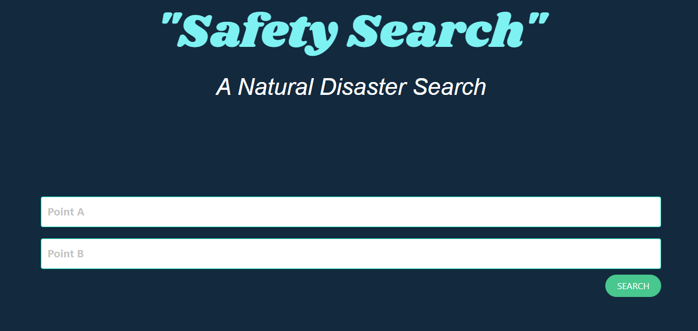

# Disaster Search

## Description

Natural Disaster Search is a web application that will show you natural disasters in any area you would like to search. Maybe you are heading to California in the summer and want to check to see if there are wildfires in your area or you are just curious if there are any natural disasters happening around you, with Natural disaster search you will get a radius of 100 miles from the location you search. 

## Usage

Search for two different states in the "Point A" and "Point B" box. Click the search button. This will populate a table with any and all natural disasters between the two points. You can click the link through for more information. 

## Deployed Site  
GITHUB Repository: https://github.com/emileebogdan/project-1-travel-and-events 
Deployed Link: https://emileebogdan.github.io/project-1-travel-and-events/ 

## Credits  
### Collaborators 
Courage Cottrell: https://github.com/ccottrell52  
Cory Carrol: https://github.com/CoryCarroll  
JW Beach: https://github.com/jwbeach  
Emilee Bogdan: https://github.com/emileebogdan 

### API's
EONET by NASA: https://eonet.gsfc.nasa.gov/docs/v3  
GoogleMaps: https://developers.google.com/maps  